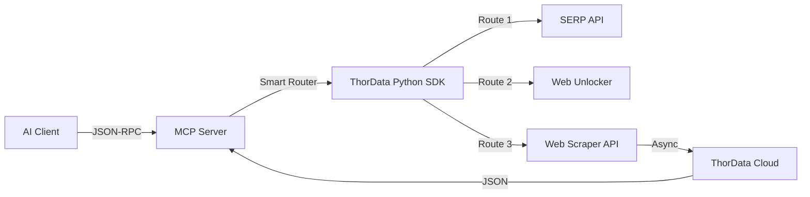

# ⚡ ThorData MCP Server

<div align="center">


**The Bridge between LLMs and the Real World.**
*Connect Claude, Cursor, and AI Agents to ThorData's Residential Proxies & Scraping Infrastructure.*

[](https://www.python.org/)
[](https://modelcontextprotocol.io/)
[](https://hub.docker.com/)

</div>

---

## 📖 Overview

This MCP (Model Context Protocol) Server exposes **ThorData's** powerful data gathering capabilities as executable tools for AI models. It features a **Smart Routing** engine that automatically selects the best extraction strategy based on the target URL.

### ✨ Key Features

*   **🧠 Smart Scrape**: One tool to rule them all. Automatically routes requests:
    *   **E-Commerce**: Amazon (Product/Search/Reviews) -> Structured JSON.
    *   **Social Media**: YouTube (Video/Channel), TikTok, Instagram -> Structured JSON.
    *   **Maps**: Google Maps (Details/Reviews) -> Structured JSON.
    *   **General Web**: Any other website -> Markdown (via Headless Browser).
*   **🕷️ Browser Automation**: Generate valid WebSocket URLs to drive **Scraping Browsers** (Playwright/Puppeteer) directly from the LLM.
*   **🔍 Real-time Search**: Google Search integration with anti-bot bypassing.
*   **🛡️ Enterprise Grade**: Built on `thordata-sdk` with automatic retries, rotation, and error handling.

---

## 🚀 Quick Start (Docker)

The easiest way to run the server is via Docker. This ensures a consistent environment.

### 1. Prerequisites
Get your credentials from the [ThorData Dashboard](https://dashboard.thordata.com/):
*   **Scraper Token**: For SERP & Web Unblocking.
*   **Public Token/Key**: For Task Management (Video/Data scraping).
*   **Browser Credentials**: For Scraping Browser Automation.

### 2. Run Container
```bash
# Run in interactive mode (Stdio)
docker run -i --rm \
  -e THORDATA_SCRAPER_TOKEN="your_token" \
  -e THORDATA_PUBLIC_TOKEN="your_public_token" \
  -e THORDATA_PUBLIC_KEY="your_public_key" \
  -e THORDATA_BROWSER_USERNAME="your_browser_user" \
  -e THORDATA_BROWSER_PASSWORD="your_browser_pass" \
  thordata-mcp:0.1.0
```

### 3. Connect to Claude Desktop
Add the following to your `claude_desktop_config.json`:

```json
{
  "mcpServers": {
    "thordata": {
      "command": "docker",
      "args": [
        "run", "-i", "--rm",
        "-e", "THORDATA_SCRAPER_TOKEN=...",
        "-e", "THORDATA_PUBLIC_TOKEN=...",
        "-e", "THORDATA_PUBLIC_KEY=...",
        "-e", "THORDATA_BROWSER_USERNAME=...",
        "-e", "THORDATA_BROWSER_PASSWORD=...",
        "thordata-mcp:0.1.0"
      ]
    }
  }
}
```

---

## 🛠️ Local Development

### Installation

```bash
git clone https://github.com/Thordata/thordata-mcp-server.git
cd thordata-mcp-server

# Install dependencies (requires uv or pip)
pip install -e .
```

### Configuration
Create a `.env` file:

```ini
THORDATA_SCRAPER_TOKEN=xxx
THORDATA_PUBLIC_TOKEN=xxx
THORDATA_PUBLIC_KEY=xxx

# For Browser Automation Tool
THORDATA_BROWSER_USERNAME=xxx
THORDATA_BROWSER_PASSWORD=xxx
```

### Debugging
Run the industrial-grade acceptance suite to verify your environment:

```bash
python acceptance_test.py
```

---

## 🧰 Available Tools

| Tool Name | Description |
| :--- | :--- |
| **`smart_scrape`** | **The Core Tool.** Input *any* URL. It auto-detects Amazon/YouTube/Maps/TikTok and returns structured JSON. For generic sites, it returns Markdown. |
| **`google_search`** | Perform Google searches using ThorData's SERP API. |
| **`read_url`** | Convert a webpage to LLM-friendly Markdown (General purpose). |
| **`get_scraping_browser_url`** | Generates a secure `wss://` endpoint for Playwright/Puppeteer sessions. |

---

## 🏗️ Architecture



## 📄 License

MIT